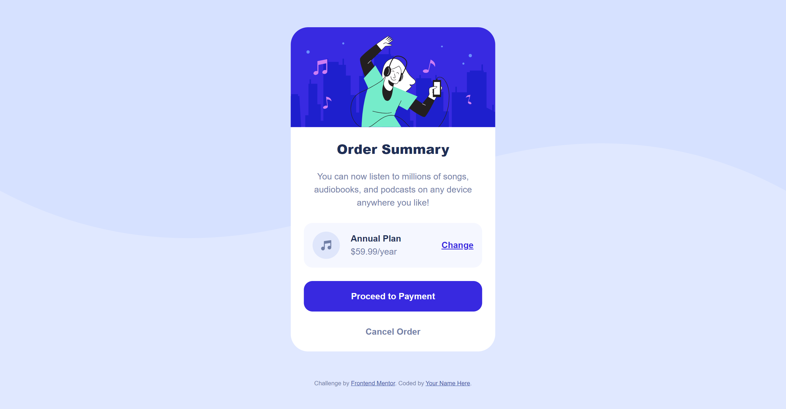
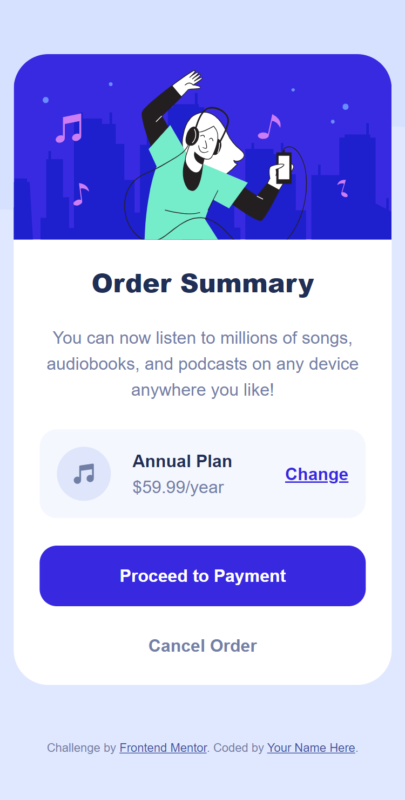

# Frontend Mentor - Order summary card solution

## Table of contents

- [Overview](#overview)
  - [The challenge](#the-challenge)
  - [Screenshot](#screenshot)
  - [Links](#links)
- [My process](#my-process)
  - [Built with](#built-with)
  - [What I learned](#what-i-learned)
- [Author](#author)

## Overview

This is a solution to the [Order summary card challenge on Frontend Mentor](https://www.frontendmentor.io/challenges/order-summary-component-QlPmajDUj). Frontend Mentor challenges help you improve your coding skills by building realistic projects. 

### The challenge

Users should be able to:

- See hover states for interactive elements

### Screenshot




### Links

- Solution URL: [solution](https://github.com/Freedteck/order-summary-component-main)
- Live Site URL: [live site](https://freedteck.github.io/order-summary-component-main/)

## My process

### Built with

- Semantic HTML5 markup
- CSS custom properties
- Flexbox
- Mobile-first workflow
- [Bootstrap](https://getbootstrap.com/) - Css framework

### What I learned

I learn the use of fonts

```css
@font-face {
    font-family: "Red Hat Display";
    src: url('https://fonts.google.com/specimen/Red+Hat+Display');
}
```

## Author

- Frontend Mentor - [@Freedteck](https://www.frontendmentor.io/profile/Freedteck)